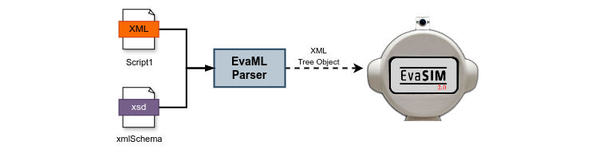

# **EvaML** and **EvaSIM** Project

This repository contains the source codes of projects related to the EVA opensource robotics platform, the **EvaML** language and the **EvaSIM** simulator. The term EvaML is the acronym for **Embodied Voice Assistant Markup Language**, a language for developing interactions for the EVA robot based on XML. EvaSIM is a simulator designed to serve as a testing tool for these scripts, also serving as a tool to support learning, both about the functioning of the physical robot (its capabilities) and the script programming language, EvaML.

At the end of 2023 we started working on proposing a new software architecture for the EVA robot, a modular architecture that allows it to be easily extended, allowing the addition of new functionalities to the robot, such as: new **sensors/actuators** and new elements of **verbal and non-verbal** communication.

