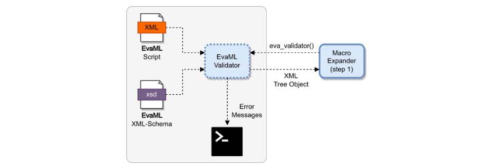
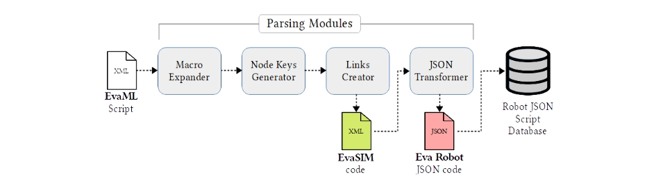

# **EvaML** (**eva_parser**)

This folder contains the *parser* of the EvaML language. After processing the *parser* over a script, a new XML file is generated and can be imported into the simulator. The *parser* must be executed on the command line as in the following example.

```
> python3 eva_parser.py script.xml -c
```
In this same directory you will also find the **evaml-schema** folder which contains the **xml-schema** file with the definitions of the elements of the EvaML language. For a new element to be added to the EvaML language, it must be defined within the **xsd** file.

The EvaML language *parsing* process takes place in a few steps.Before actually starting the *parsing* process, during the first step, the language validation submodule is called and validates the XML script using the language's XML-Schema file. If there is an error in the code, *parser* will indicate the error and stop the parsing process. **Figure 1** shows how the process happens.



<p align="center">
<strong>Figure 1.</strong> Execution of the EvaML language validation submodule.
</p>

</br>

In the previous version of EvaML's *parser*, the entire process happened in 4 steps: **expansion of macros**, **the generation of node keys**, **the creation of links** and **JSON mapping (transformer)**. The current version of *parser*, which is integrated into the new software architecture of EVA and EvaSIM, does not perform step 4, which was intended for generating and exporting the script in JSON format compatible with the robot's visual programming language, the VPL. **Figure 2** shows the entire process.


<p align="center">
<strong>Figure 2.</strong> The steps of the *parsing* process of the EvaML language.
</p>
</br>

If everything is correct, after the *parsing* process, a new XML file will be generated. The name of the generated file will be the name defined in the *name* attribute within the XML script.