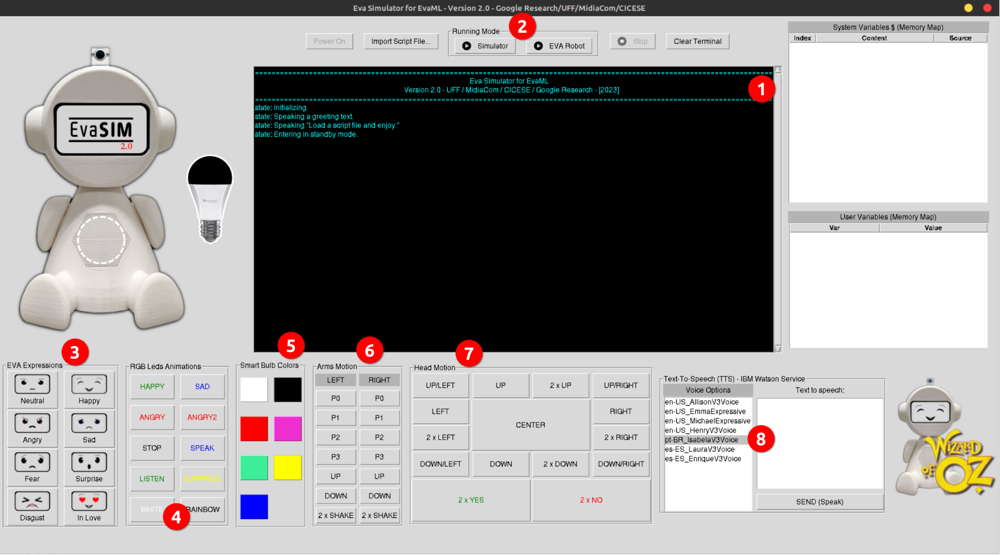
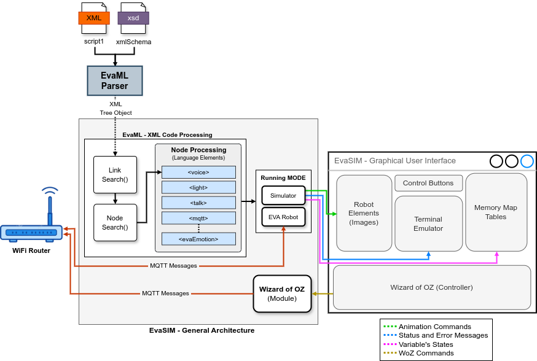

# **EvaSIM 2.0 - Simulator Software for the EVA robot**
 
The EvaSIM simulator was developed with the aim of assisting in the development of scripts for the EVA robot. One of its applications is to serve as a testing and debugging platform for scripts developed for the physical robot, representing, in a simplified way, the physical elements that make up the robot, such as: the Matrix Voice board, the display with the robot's expressions, the smart bulb and etc. EvaSIM plays an important role as an aid tool in the development of scripts for EVA, as it is capable of displaying information about what is being executed in your terminal emulator, in addition to presenting (in two tables) the variables used in the scripts next to their respective values.

The simulator can run both the codes generated by the EvaML language parser and the JSON files that represent the graphic scripts created with the EVA Visual Programming Language, VPL. After loading a script into the simulator, it is capable of interpreting this code and each element executed has its representation in the simulator interface, such as: the robot's facial expressions, the smart lamp, the LEDs on the robot's chest or some text that was spoken to him.


This work proposes a new version for the **EvaSIM simulator**. In this new version, the simulator now has two execution modes: **Simulator Mode** and **EVA Robot Mode**. Furthermore, a **Wizard of OZ (WoZ)** control panel was added to its graphical user interface (GUI), which allows the robot to be operated remotely through buttons that control its functionalities. The next figure presents the new EvaSIM interface with all its new elements and resources indicated by items 1 to 8.



As follow, a brief description of each of these items will be made.

**Terminal Emulator** - In item (1), the EvaSIM terminal emulator can be seen. In this new version, in addition to having its data presentation area expanded, by increasing its number of lines and columns, a scroll bar was added to the right side of the terminal, allowing greater control over the display of text that exceeds its limit on the number of visible lines.

**Execution Modes** - As previously stated, the simulator can run in *Simulator* and *EVA Robot* modes (item (2)). In the first mode, the simulator works as in its previous version, simulating the behavior of the robot's physical components (eyes, LEDs, head movement, etc.) simulating voice capture with a window with a text box and using a keyboard as an input interface. To simulate facial expression recognition, EvaSIM uses a window with expression options represented through *Emojis*.

In *EVA Robot mode*, the simulator works, in part, as a script player for the physical robot. The script elements, which control the robot's elements, start to act directly on the robot's physical components, that is, a command to move the robot's head, makes its head actually move, as well as the other elements: the robot's eyes, its RGB LEDs and its smart bulb. Furthermore, the robot's speech is now controlled by the Text-To-Speech module (eva-tts-module) of the physical robot. This module is responsible for requesting the IBM-Watson cloud service, transforming text into speech (in audio). It is important to highlight that the simulator, even in EVA Robot mode, continues to display, in its terminal, the elements that are being executed and the variables continue to be displayed in the memory tables in the graphical user interface. In this mode, unlike *Simulator mode*, voice capture is done by the Speech-To-Text module (eva-stt-module) of the physical robot. This module is responsible for requesting STT services from the Google Cloud API. After transforming the speech (audio file) into text (a string), the eva-stt module sends the string returned by the Google API to the simulator and this information is displayed in the memory table that presents the values ​​of the special variable “$” or the variable specified in the new var attribute of the **\<listen>** command. This behavior is repeated for all EVA features that return values ​​obtained from interaction with users, such as: **\<userEmotion>**, **\<userID>** and **\<qrReader>**.

**Display Control** - Item (3) in the figure controls the robot's facial expressions and allows the user to change the EVA's facial expression to one of its eight available expressions.

**RGB LED Animation** - The LEDs on the EVA's chest play an important role as a non-verbal communication element for the robot. Item (4) presents buttons that can execute one of the 10 possible LED animations available for the EVA.

**Smart Bulb** - Item (5) allows the smart bulb to be turned on and off as well as having its color selected through the group of buttons available on the interface.

**Arm Movement** - In this new proposal for the EVA robot, the ability to move its arms has been added. Item (6) shows 14 buttons (seven for each arm) with the types of possible movements.

**Head Movement** - In item (7) you can see the buttons for controlling the movement of the robot's head.

**Text-To-Speech** - The last item, number 8, allows the user to listen to the audio generated by IBM Watson from the texts entered into the interface. Some voice and language options are available. You can use this feature to check how the robot speaks when using certain phonemes. The sentences generated through this tool are stored in the robot's audio folder (TTS) and, if they are spoken by the robot, in future interactions, they will be available offline.




This repository contains the source codes of EvaSIM:

1. The **EvaML** language parser project

2. The **EvaSIM** simulator project

If you want to run EvaSIM from Python source you need to install all necessary libraries. To learn how to proceed, see Appendix A in the EvaML language reference manual from this link: (https://github.com/midiacom/eva-robot/blob/master/EvaML-Reference-Manual/EvaML-Reference-Manual.pdf)

In order to facilitate the use of EvaSIM, we managed to package the software with all its dependencies, without having to download and install Python modules. We did it in two versions, one for Windows and one for Linux. To run EvaSIM we recommend **Windows 10** and Linux distributions **Ubuntu 20.04.4** and Linux **Mint 20.3**.
 
1. First, you should download the correct version for your system.
 
    * **EvaSIM (Windows Version):** [EvaSIM-Windows.zip](https://drive.google.com/file/d/1-ZOpjehVLCzHUqYyj3ewoS3vAT9nr9ny/view?usp=sharing)

 
    * **EvaSIM (Linux Version):** [EvaSIM-Linux.zip](https://drive.google.com/file/d/1WrFI_lyTzJTbk_ujCDx_FoztU4Obauo9/view?usp=sharing)

 
    After downloading the zip file, you should unzip it.
 
    So, you will see an "*eva_sim*" folder. 
 
    Enter the "*eva_sim*" folder and double-click on the "*eva_sim.exe*" file, in the case of the Windows version, or the "*eva_sim*" file, in the case of the Linux version.
 
    Now, **activate** the simulator using the EvaSIM **"Power On"** button, as shown in the next figure.
    
 
    If you hear a greeting, everything should be working correctly!

 
`In the Linux version, if after two clicks on "eva_sim" file the simulator does not run, please check if the file has permission to be executed. This can be done by clicking with the right mouse button on the file, selecting the properties option and in the permissions tab activating the option "allow the execution of the file". This can also be done via the command line as follows:`
```
sudo chmod +x eva_sim
```
`In case the previous versions didn't work, or you use a linux based RPM package, as in the case of the Fedora distribution, you can try to install the modules through the terminal and run the simulator using the source code. The source code, also in two flavors, is available through this link:`
[https://github.com/midiacom/eva-robot/tree/master/EvaML-EvaSIM source code](https://github.com/midiacom/eva-robot/tree/master/EvaML-EvaSIM%20source%20code)

** You should use this [document](https://github.com/midiacom/eva-robot/blob/master/EvaSIM%20Testing%20Version/EvaSIM%20-%20Installing%20Instructions%20-%20Appendix%20A.pdf
) with installation instructions.